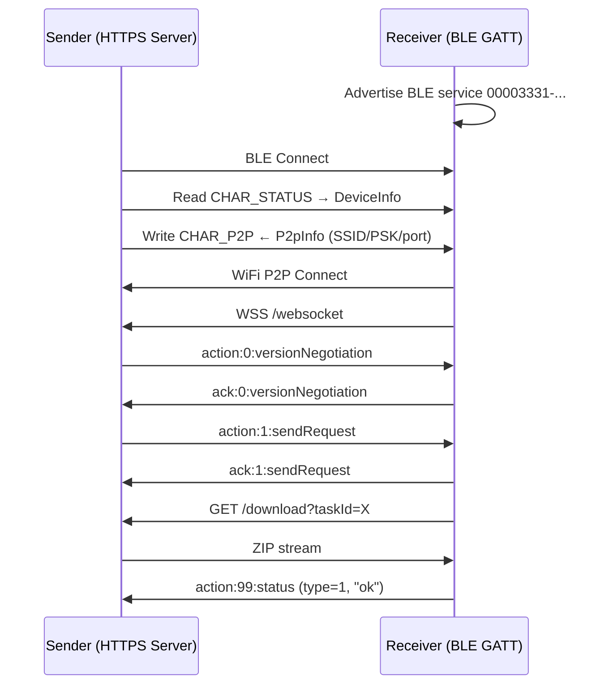

# mtapy

Python3 implementation of the MTA (Mutual Transmission Alliance) file transfer protocol based on [CatShare](https://github.com/kmod-midori/CatShare/)

MTA is used by Xiaomi, OPPO, vivo, OnePlus, Realme, and other Android manufacturers for cross-brand file sharing.

互传联盟（Mutual Transmission Alliance）是由小米、OPPO和vivo于2019年成立的，旨在实现跨品牌(安卓)设备之间的快速文件传输。Android阵营已加入的有：小米、OPPO、vivo、联想、realme、努比亚、海信、魅族、一加、坚果、黑鲨、中兴、ROG、华硕、三星、荣耀

Now your favorite desktop OS joins the alliance! 现在你钟爱的桌面操作系统也加入联盟！

## Linux (Ubuntu) Support 🐧

mtapy can receive files from 互传 (MTA) devices on **Linux** — verified
end-to-end on **Ubuntu 20.04** with a Xiaomi phone (the phone shows
「发送成功」and the file arrives intact).

### Requirements

- Ubuntu 20.04+ with **BlueZ** (tested on 5.53) and **NetworkManager**
- A Bluetooth LE adapter (BLE peripheral mode)
- A Wi-Fi adapter managed by NetworkManager
- Python 3.11+ (the code uses PEP 585 type hints)

### Installation

```bash
python3 -m venv .venv
.venv/bin/pip install "dbus-fast" "bleak>=0.21,<0.23" "websockets>=12" "cryptography>=41,<43"
```

> Note: bleak 3.x is not compatible with BlueZ 5.53; use 0.22.x.

### Run

```bash
.venv/bin/python demo_linux.py
```

On your Android phone: share a file → 互传 → tap the device
(「未知设备」— see limitations) → the file lands in `received_files/`.

### How it works

1. **Advertise** the MTA BLE service (`00003331-...`) via BlueZ
2. **GATT server** — CHAR_STATUS (read) + CHAR_P2P (write)
3. The phone reads our `DeviceInfo` (`state=0` = ready) and writes P2P
   credentials (SSID/PSK/port) over BLE
4. We join the phone's WiFi Direct group via NetworkManager (a
   **BSSID-pinned connection profile**)
5. WebSocket handshake + HTTPS download of the ZIP archive
6. Files are extracted into `received_files/`

### Known limitations

- **「未知设备」in the device list**: BlueZ 5.53 only supports 31-byte
  legacy advertising, which cannot carry the full MTA advertisement
  (62 bytes). The device works but the name isn't shown. Upgrading to
  BlueZ ≥ 5.55 (extended advertising) fixes the name.
- **Wi-Fi join may need a retry**: NetworkManager's scan often misses the
  phone's freshly-created P2P group; the BSSID-profile fallback usually
  catches it on a retry.
- `192.168.49.1` (the P2P group-owner address) is currently hardcoded.
- Large files are buffered in memory (no streaming to disk yet).

## Progress

vibing in progress, **not ready** for production use. 本项目当前状态：vibe出来了个demo  🤣

`python demo.py --auto-connect`  

适用于macOS。执行上面命令后，在安卓手机上发起文件传输，可能有弹窗要求连接某 DIRECT-XXX 这个WIFI，允许就可以在 received_files 目录收到文件了。

因为额度用完了，所以就先到这儿了，等贤者时间结束，再继续完善。

## ToDo

- [ ] fix "Unknown device" on Android
- [ ] add an awesome avatar (if possible)
- [ ] send files *to* Android
- [ ] auto delete WIF Direct
```
security default-keychain -s tempwifi.keychain
security unlock-keychain -p temp tempwifi.keychain

sudo networksetup -setairportnetwork en0 "SSID" "PASSWORD"

# ... use network ...

# cleanup
sudo networksetup -removepreferredwirelessnetwork en0 "SSID"
security delete-keychain tempwifi.keychain
security default-keychain -s login.keychain
```
- [ ] useless 5GHz


## Protocol Overview



## Architecture

The library is structured in **sans-io** style:

- `protocol.py`, `receiver.py`, `sender.py` - Pure protocol logic, no I/O
- `transport.py` - Asyncio-based transport implementation
- `interfaces.py` - Abstract interfaces for crypto, BLE, WiFi P2P

## Protocol Overview

1. **BLE Discovery** - Devices advertise via BLE GATT service
2. **Credential Exchange** - Sender writes WiFi P2P credentials to receiver via BLE
3. **P2P Connection** - Receiver joins sender's WiFi P2P group
4. **WebSocket Handshake** - Version negotiation and transfer request
5. **File Transfer** - Receiver downloads ZIP archive over HTTPS


## Installation

```bash
pip install mtapy

# With crypto support (ECDH/AES for encrypted transfers)
pip install mtapy[crypto]

# With BLE support (device discovery using bleak)
pip install mtapy[ble]

# All optional dependencies
pip install mtapy[all]
```

## Running on macOS

1. **Install Dependencies**:
   ```bash
   pip install cryptography bleak websockets
   ```

2. **Run BLE Discovery Demo**:
   To scan for nearby MTA-compatible devices (Xiaomi, OPPO, vivo, etc.):
   ```bash
   python3 macos_demo.py
   ```

3. **Development/Test**:
   You can run the included unit tests using `pytest`:
   ```bash
   pytest mtapy/tests/ -v
   ```


## License

GPL-3.0
